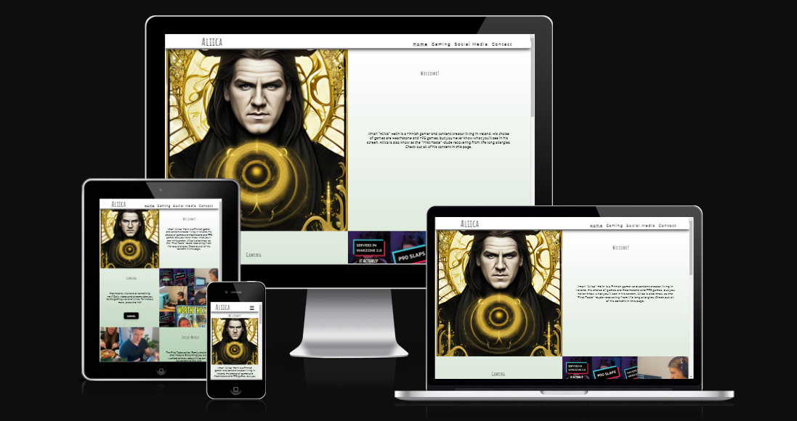
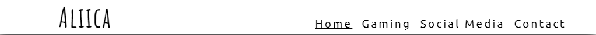
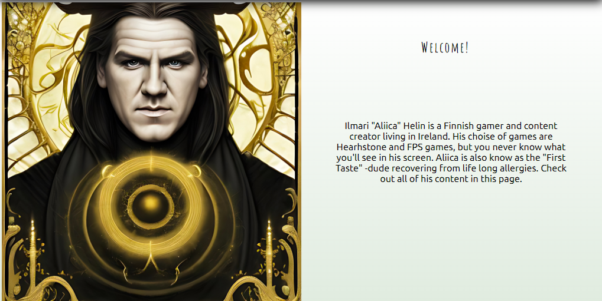
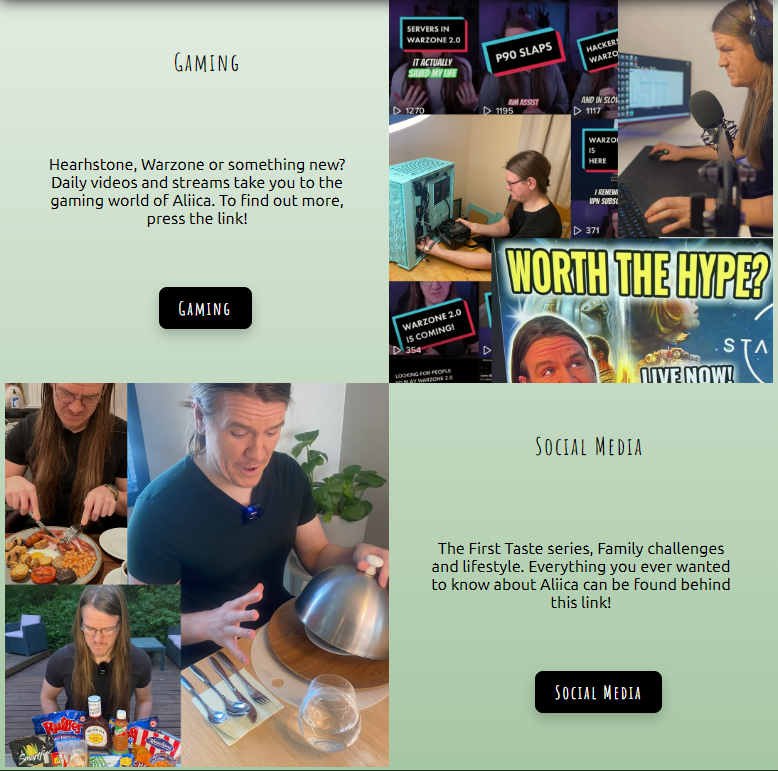
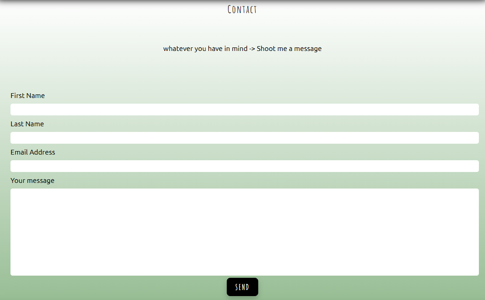
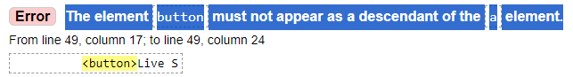

# Welcome - Aliica website

This is my first independent project as a up and coming full stack developer, Studying towards my Diploma with Code Institute.

[View Aliica on Github Pages](https://github.com/JuttaAliisa/Aliica)

# Content

- [Welcome - Aliica website](#welcome---aliica-website)
- [Content](#content)
- [User experience](#user-experience)
  - [Key information](#key-information)
  - [Goal](#goal)
  - [User goals](#user-goals)
- [Design](#design)
  - [Fonts](#fonts)
  - [Wireframes](#wireframes)
- [Features](#features)
  - [Navigation Bar](#navigation-bar)
  - [Landing page](#landing-page)
  - [Footer](#footer)
  - [Content pages](#content-pages)
  - [Contact form](#contact-form)
  - [upcoming features](#upcoming-features)
- [Technologies](#technologies)
  - [Languages](#languages)
  - [Resources](#resources)
- [Testing](#testing)
  - [Diagnostics](#diagnostics)
  - [Manual testing](#manual-testing)
  - [Fixed bugs](#fixed-bugs)
  - [Deployment](#deployment)
- [Credits](#credits)
  - [Content](#content-1)
  - [Media](#media)
  - [Acknowledgements](#acknowledgements)

# User experience

This website has been created for a content creator Aliica, who produces content for multible platforms. The main goal is to collect all the channels together to be easily found when the consumer is looking for it. The request from the customer is to create more detailed and personal version of the popular linktr.ee website used by many content creators.

The website bring together all the information about this creator and more can be easily added if the portfolio grows.

## Key information

- Who is Aliica
- Preview what can be found from the site
- Detailed information about his gaming content
- Detailed information about his social media precence
- Contact form

## Goal

- Responsive site
- Get together all the platforms with content
- Allow people to contact him easily

## User goals

- Easily find all the content
  - Solution: All the content is available through the website within just two pages. Frontpage gives a snapshot of the content and using buttons or nav it is easy to find more info
- Contact Aliica
  - Solution: Contact form is easy to find and use. Minimal requirements for contacting
- Get to know Aliica better
  - Solution: No matter how you find him initially, you will find more details about him from this website. If you come through from gaming content you are able to deepdive to socials or vice verca.

# Design

## Fonts

- Main font from Google fonts Ubuntu
- Header font from Google fonts Amatic SC

## Wireframes

Wireframes were created for mobile and desktop
[Wireframe](docs/design/wireframe.png)

# Features

## Navigation Bar

- Featured on all four pages, the full responsive navigation bar includes links to the Home page, Gaming, Social Media and Contact page and is identical in each page to allow for easy navigation.
- This section will allow the user to easily navigate from page to page across all devices without having to revert back to the previous page via the "back" button. Active page is indicated with underline for the user to easily identify the page they are in at the moment.
- Smaller screens have the navigation behing the well know "burger" icon that is familiar to the users.

## Landing page

- Landing page / frontpage starsts with a picture of the creator together with shor introductory section.
- The meaning of the section is to give a short summary of the content of the page and reassure the the user has landed to the correct page, through the picture of the familiar face and text.

- The content section of the landing page gives a short instroduvtion to the available pages, together with buttons to directly enter the page. This gives the user the idea of the content for the said page and makes it easy to go further in to the site.
- All the buttons have a hover feature, giving the user feedback about the clickability of the link

## Footer

- The footer section includes copyright information and button for Youtube Live stream. Youtube is the main platform of the customer and when reasonable this link is offered.
- The footer remain the same through the whole website and it becomes visible when the user reaches the end of the page (scroll down)

## Content pages

- Gaming and social media pages are content pages of this site. Gaming includes the customers social media outlets and descriptions for his gaming content. The texts are descriptive and telling a story about his gaming before and now.
- Each channel has it's own header, relevant social media logo, description and link to the platform. Each link will open to a new tab to make sure the user stays on the site

## Contact form

This simple contact form is used to contact Aliica. All users can use the same form. The form is transperent showcasing the beautiful gradient backround. All info is mandatory and the last section is free text for any message the user might have.

## upcoming features

- The content pages will have some imagenery once Aliica has produced suitable mediaset the will complement the overall look of the website

# Technologies

## Languages

HTML and CSS were used for this website.

## Resources

- Figma - Used to create wireframes
- CodeAnywhere - To code
- Github - To save and store the files for the website.
- Google Fonts - To import the fonts used on the website.
- Font Awesome - For the iconography on the website.
- Google Dev Tools - To troubleshoot and test features, solve issues with responsiveness and styling.
- [Favicon.io](https://favicon.io/) To create favicon.
- [Am I Responsive?](http://ami.responsivedesign.is/) To show the website image on a range of devices.
  
# Testing

## Diagnostics

- HTML
  - No errors were returned when passing through the official [W3C validator](https://validator.w3.org/nu/?doc=https%3A%2F%2Fcode-institute-org.github.io%2Flove-running-2.0%2Findex.html)
- CSS
  - No errors were found when passing through the official [(Jigsaw) validator](https://jigsaw.w3.org/css-validator/validator?uri=https%3A%2F%2Fvalidator.w3.org%2Fnu%2F%3Fdoc%3Dhttps%253A%252F%252Fcode-institute-org.github.io%252Flove-running-2.0%252Findex.html&profile=css3svg&usermedium=all&warning=1&vextwarning=&lang=en#css)
- Lighthouse
  - Accessibility 100
  - Best practises 100
  - SEO 100
  - performance 48/100 mainly because of bad image optimazation (next sprint agenda)
  
  [Disgnostics](docs/testing/diagnostics.png)

## Manual testing

To ensure that the site works, I tested forms, buttons and responsiveness manually with multiple devices and browsers:

- Lenovo Legion laptop
- Iphone 13PRO
- Macbook pro 13"
- iPad Pro 11"
- Safari
- Chrome
No problems were found
  
## Fixed bugs

- The only bug found during the project was "The element button must not appear as a descendant of the a element." This bug was fixed. The developer had no idea this was not valid HTML and the buttons were actually working before the fix.
- Some Javascript was necessary to use to quick fix this and the fix is not perfect, but the page was styled using buttons and there was not enough time to rewrite the whole code aroun a-element, the fix is in place until further notice.

No unfixed bugs remain.

## Deployment

The site was deployed to GitHub pages. The steps to deploy are as follows:

- In the GitHub repository, navigate to the Settings tab
- From the source section drop-down menu, select the Master Branch
- Once the master branch has been selected, the page will be automatically refreshed with a detailed ribbon display to indicate the successful deployment.
- The live link can be found here - [LINK](https://juttaaliisa.github.io/Aliica/index.html)

# Credits

## Content

- The texts are produced by Jutta Helin
- The header and footer design is inspired by the Code Institute walk through project "Love Running"
- The icons in the footer were taken from Font Awesome
- Instructions and inspiration (but no direct copy of the code) has been searched from <https://stackoverflow.com/> and <https://www.w3schools.com/> together with Code Institute tutorials from full stack development course.

## Media

- Pictures are created by Ilmari "Aliica" Helin
- Fonts from Google fonts
- Youtube colours from [Youtube resources](https://www.youtube.com/howyoutubeworks/resources/brand-resources/?_gl=1*6uwtl9*_up*MQ..*_ga*MTYyNTE2NTY4My4xNzAxNjE3MTc2*_ga_M0180HEFCY*MTcwMTYxNzE3NS4xLjAuMTcwMTYxNzI3MC4wLjAuMA..#logos-icons-and-colors)
- Responsive picture in readme from <https://ui.dev/>

## Acknowledgements

- My patient Mentor Jubril Akolade for support and instructions
- My everloving husband for granting me the time to make this project and further my education
- Code Institute for the opportunity
- My fellow OCT 2023 group for mental and peer support
